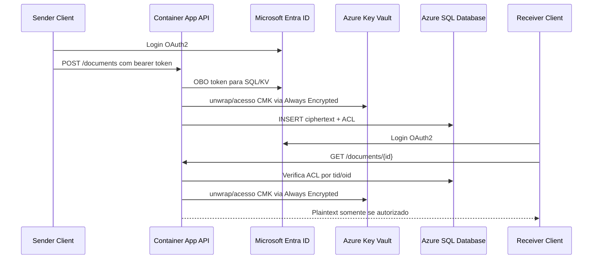

# OBO SQL Server — Azure SQL Always Encrypted PoC

[](https://orcid.org/0009-0006-0765-4201)
[](LICENSE)
[](#)
[](#)
[](#)
[](https://github.com/EdneiMonteiro/obo-sqlserver/commits)

## Visao Geral

Este repositorio contem uma prova de conceito (PoC) para validar acesso delegado com OAuth2 On-Behalf-Of (OBO) entre uma API em Azure Container Apps, Azure SQL Database e Azure Key Vault.

O objetivo e demonstrar como armazenar documentos sensiveis em Azure SQL usando criptografia de coluna com Always Encrypted, mantendo o material criptografico fora do banco em Azure Key Vault, de forma que um administrador SQL sem permissao no Key Vault nao consiga ler plaintext.

Este projeto foi criado para aprendizado, avaliacao tecnica e experimentacao.

## Aviso Importante

Este repositorio contem **codigo de exemplo e nao e destinado para uso em producao**.

Antes de utilizar qualquer parte deste projeto em um ambiente produtivo ou critico, revise, valide, proteja e adapte o codigo conforme os requisitos da sua organizacao, incluindo:

- Seguranca
- Escalabilidade
- Confiabilidade
- Monitoramento
- Observabilidade
- Custos
- Conformidade
- Privacidade / LGPD

Leia tambem:

- [DISCLAIMER.md](./DISCLAIMER.md)
- [SUPPORT.md](./SUPPORT.md)

## O que este exemplo demonstra

- Login de usuario com Microsoft Entra ID
- Fluxo OAuth2 On-Behalf-Of para Azure SQL
- Acesso delegado a Azure Key Vault para Always Encrypted
- Azure SQL com dados sensiveis criptografados em coluna
- Autorizacao por documento usando `tid` + `oid` do token Entra
- API .NET 8 Minimal API rodando em Azure Container Apps
- Infraestrutura como codigo com Bicep
- Scripts de preflight, deploy, validacao e cleanup
- Documentacao explicita do limite entre near-E2EE e E2EE estrito

## Near-E2EE vs E2EE estrito

Esta PoC valida um modelo **near-E2EE**:

- O SQL Admin nao deve conseguir ler plaintext.
- A chave mestra fica no Azure Key Vault.
- A aplicacao usa a identidade delegada do usuario para acessar SQL e Key Vault.
- A aplicacao ainda e trusted compute e pode ver plaintext em memoria durante operacoes autorizadas.

Se o requisito for **E2EE estrito**, a criptografia e a descriptografia devem acontecer no cliente final, e o backend deve armazenar apenas ciphertext e metadados.

## Pre-requisitos

- Azure CLI autenticado (`az login --tenant <tenant-id>`)
- GitHub CLI autenticado (`gh auth login`)
- .NET 8 SDK
- Azure CLI Bicep (`az bicep version`)
- Permissao para criar recursos no tenant/subscription alvo
- Permissao para criar App Registration no Microsoft Entra ID
- Acesso a uma subscription com budget suficiente para a PoC

Tenant alvo: definir antes de rodar o preflight (nao versionar no repositorio).

## Como iniciar

### Editar no VS Code

Sim. O repositorio inclui configuracao em `.vscode/` com extensoes recomendadas, tarefas de restore/build/test/run e launch para debug da API.

```powershell
code .
```

No VS Code:

1. Instale as extensoes recomendadas quando solicitado.
2. Use `Terminal > Run Task` para `dotnet: restore`, `dotnet: build`, `dotnet: test` ou `api: run`.
3. Use `Run and Debug > API: debug` para depurar a API.

### Provisionar e executar

1. Execute o preflight:

   ```powershell
   .\scripts\preflight-azure.ps1 -TenantId "<entra-tenant-id>" -ForecastsPath ".\scripts\forecasts.example.json"
   ```

2. Ajuste os parametros de infraestrutura:

   ```powershell
   Copy-Item .\infra\bicep\main.parameters.json.example .\infra\bicep\main.parameters.local.json
   ```

3. Faça deploy da infraestrutura:

   ```powershell
   .\scripts\deploy-infra.ps1 -SubscriptionId "<subscription-id>" -Location "brazilsouth" -ParametersFile ".\infra\bicep\main.parameters.local.json"
   ```

4. Configure Always Encrypted:

   ```powershell
   .\scripts\initialize-always-encrypted.ps1 -SqlServerName "<server>" -DatabaseName "sqldb-obo-sql-poc" -KeyVaultName "<kv-name>" -KeyName "cmk-documents"
   ```

5. Configure a API:

   ```powershell
   cd .\src\api
   dotnet restore
   dotnet run
   ```

6. Execute as validacoes:

   ```powershell
   .\scripts\validate-poc.ps1 -BaseUrl "https://<app-url>"
   ```

## Arquitetura



| Recurso | Finalidade |
|---------|------------|
| Azure Container Apps | Hospeda a API .NET 8 |
| Azure SQL Database | Armazena documentos criptografados e metadados de ACL |
| Azure Key Vault | Armazena a Column Master Key usada pelo Always Encrypted |
| Microsoft Entra ID | Autenticacao, tokens e fluxo OBO |
| Log Analytics | Logs operacionais sem payload sensivel |

## Documentacao

| Documento | Descricao |
|-----------|-----------|
| [docs/arquitetura.md](docs/arquitetura.md) | Arquitetura e principais decisoes |
| [docs/fluxo-logico.md](docs/fluxo-logico.md) | Fluxo detalhado de escrita e leitura |
| [docs/componentes-azure.md](docs/componentes-azure.md) | Componentes Azure e escolhas de SKU |
| [docs/modelo-ameacas.md](docs/modelo-ameacas.md) | Ameacas cobertas, nao cobertas e riscos residuais |
| [docs/validacao.md](docs/validacao.md) | Roteiro de validacao da PoC |
| [docs/publicacao.md](docs/publicacao.md) | Checklist antes de tornar o repositorio publico |

## Suporte

Este projeto **nao possui SLA nem suporte oficial**.

Veja [SUPPORT.md](./SUPPORT.md) para detalhes.

## Aviso Legal

O uso deste projeto esta sujeito aos termos descritos em [DISCLAIMER.md](./DISCLAIMER.md).

## Contribuicoes

Contribuicoes podem ser aceitas a criterio do mantenedor.

## Marcas Registradas (Trademarks)

Os nomes e servicos da Microsoft sao utilizados apenas para fins descritivos.

Este projeto **nao e afiliado, endossado ou suportado oficialmente pela Microsoft**.

O uso de marcas da Microsoft nao deve sugerir qualquer tipo de parceria ou suporte oficial.
