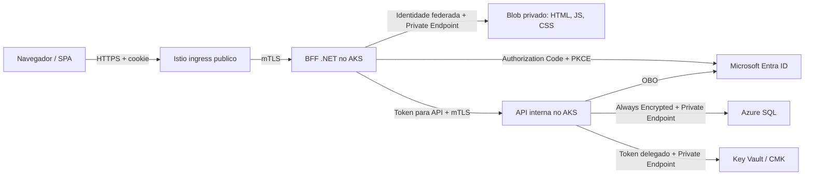

# Lab OBO com AKS, BFF e Azure SQL

[](https://orcid.org/0009-0006-0765-4201)
[](LICENSE)
[](docs/arquitetura.md)
[](OboSqlServer.sln)
[](docs/modelo-ameacas.md)
[](https://github.com/EdneiMonteiro/obo-sqlserver/commits)

## Objetivo

Lab de envio e leitura de documentos com autenticação Entra e tokens delegados
obtidos por OAuth2 On-Behalf-Of. O payload é cifrado pelo driver SQL com Always
Encrypted. A chave mestra fica no Azure Key Vault.

A SPA é armazenada em Blob privado e servida pelo BFF. BFF e API .NET 8 rodam
no AKS com Istio. O navegador usa cookie de sessão; access e refresh tokens
ficam no servidor.

Uso em laboratório. Consulte as [limitações](docs/modelo-ameacas.md) e o
[aviso legal](DISCLAIMER.md) antes de usar o código em produção.

## Apresentação para o cliente

Abra a [apresentação HTML](docs/apresentacao.html) no navegador. Ela contém os
slides, diagramas e documentos completos, sem depender de servidor ou conexão.
[Instruções de geração](docs/apresentacao.md).

## Arquitetura principal


```mermaid
flowchart LR
    Browser["Navegador / SPA"] -->|"HTTPS + cookie"| Istio["Istio ingress publico"]
    Istio -->|mTLS| BFF["BFF .NET no AKS"]
    BFF -->|"Identidade federada + Private Endpoint"| Blob["Blob privado: HTML, JS, CSS"]
    BFF -->|"Token para API + mTLS"| API["API interna no AKS"]
    BFF -->|"Authorization Code + PKCE"| Entra["Microsoft Entra ID"]
    API -->|OBO| Entra
    API -->|"Always Encrypted + Private Endpoint"| SQL["Azure SQL"]
    API -->|"Token delegado + Private Endpoint"| KV["Key Vault / CMK"]
```

O BFF executa o login OIDC e obtém o token da API. A API faz OBO para SQL e
Key Vault. Istio configura roteamento e mTLS.

O administrador SQL sem acesso à chave não consegue descriptografar o payload.
BFF e API processam plaintext nas operações autorizadas. A restrição por
destinatário usa `tid` e `oid` na API; não há Row-Level Security no banco.

## Instalação e testes

| Escopo | Obrigatório | Artefatos |
|---|---|---|
| Solução funcional | Sim | SPA/BFF/API, AKS/Istio, Entra, Blob/SQL/Key Vault privados, ACR e TLS |
| Preparação e publicação | Sim, durante a implantação | `deploy-aks.ps1` e Job `bootstrap` para assets, chaves, schema e usuários explicitamente configurados |
| Validação de segregacao | Não; opcional | `validation.bicep`, `setup-validation.ps1`, quatro identidades de teste e grants isolados |

Requisitos: PowerShell 7, Azure CLI/Bicep, kubectl, kubelogin, SDK para `net8.0`
e Node.js 20+ para os testes de navegador. O ACR constrói as imagens; Docker local
e o módulo SqlServer não são necessários.

A máquina administrativa precisa de acesso autorizado ao controle AKS.
Consulte [permissões](docs/identidades-e-permissoes.md) e
[deploy](docs/deploy.md). Substitua os placeholders abaixo.

```powershell
# 1. Validacao local
dotnet test .\OboSqlServer.sln --configuration Release

# 2. Recursos, federacoes, build e publicacao
.\scripts\deploy-aks.ps1 `
  -SubscriptionId "<subscription-id>" -TenantId "<tenant-id>" `
  -OperatorCidrs @("<approved-egress-ip>/32") `
  -SenderObjectIds @("<sender-user-object-id>") `
  -ReceiverObjectIds @("<receiver-user-object-id>")

# 3. Smoke test funcional (nao cria identidades de teste)
.\scripts\test-aks.ps1 -SubscriptionId "<subscription-id>" `
  -StatePath .\.local\aks\deployment.local.json
```

O teste de navegador e separado e exige login/MFA interativo:

```powershell
Set-Location .\tests\browser
npm ci
npx playwright install chromium
$env:OBO_BASE_URL = "https://<public-host>"
npm run test:live
```

Os testes SQL/Key Vault são opcionais e usam identidades próprias:

```powershell
# Na raiz, somente em ambiente de validacao autorizado:
.\scripts\setup-validation.ps1 -SubscriptionId "<subscription-id>" `
  -StatePath .\.local\aks\deployment.local.json
.\scripts\test-aks.ps1 -SubscriptionId "<subscription-id>" `
  -StatePath .\.local\aks\deployment.local.json -IncludeSegregation
```

[Resultados e cobertura dos testes](docs/validacao.md). O E2E foi executado em
23/09/2026; as alterações posteriores de setup/teardown e retomada foram testadas
localmente.

## Artefatos

| Caminho | Responsabilidade |
|---|---|
| `src\spa` | Interface sem cliente OAuth no browser |
| `src\bff` | OIDC, sessão server-side, CSRF, proxy da API e leitura do Blob |
| `src\api` | Autorização por documento, OBO, SQL e auditoria |
| `src\operations` | Bootstrap privado e Jobs de segregacao |
| `infra\bicep\aks.bicep` | AKS, Istio, ACR, rede, SQL, Key Vault, Blob e identidades |
| `infra\bicep\validation.bicep` | Recursos de validação opcionais; não chamado pelo deploy funcional |
| `infra\kubernetes` | Workloads, mTLS/políticas, ingress e renovação ACME |
| `scripts\deploy-aks.ps1`, `scripts\test-aks.ps1`, `scripts\aks-common.ps1` | Deploy, publicação e operação |
| `tests\browser`, `tests\scripts`, `src\*.Tests` | Testes UI/live, PowerShell e .NET |
| `.local` | Estado privado de deploy; ignorado pelo Git e pelo Docker |

O [legado ACA](docs/legacy/aca.md) usa `infra\bicep\main.bicep` e os scripts
originais. Tem configuração de rede e credenciais diferente da implantação AKS.

## Documentação

| Documento | Conteúdo |
|---|---|
| [Arquitetura](docs/arquitetura.md) | Componentes, rede, identidades e tokens |
| [Fluxo lógico](docs/fluxo-logico.md) | Login, escrita, leitura, negação e logout |
| [Identidades e permissões](docs/identidades-e-permissoes.md) | Autenticação, identificadores e grants |
| [Classes e métodos](docs/classes-e-metodos.md) | SPA, BFF, API, operações e configuração |
| [Componentes Azure](docs/componentes-azure.md) | SKUs, rede, privilégios e custos |
| [Deploy](docs/deploy.md) | Provisionar, publicar, repetir testes e remover |
| [Operação BFF/AKS](docs/aks-bff.md) | Sessão, TLS, bootstrap e troubleshooting |
| [Modelo de ameacas](docs/modelo-ameacas.md) | Controles e riscos residuais |
| [Separacao de tarefas](docs/separation-of-duties.md) | Testes SQL/Key Vault com identidades distintas |
| [Validação](docs/validacao.md) | Evidencias reais e limites dos testes |
| [Publicação](docs/publicacao.md) | Privacidade e checklist dos artefatos |
| [Apresentação HTML](docs/apresentacao.md) | Navegacao, consulta offline e regeneracao |

## Limites operacionais

O BFF tem **uma réplica/Recreate**, tickets e cache MSAL em memória e chaves
Data Protection efêmeras. Reiniciar/publicar o BFF invalida sessões. Escalar exige
estado compartilhado. O cluster de um node não oferece HA.

AKS, discos, IPs e Private Endpoints geram custos mesmo sem usuários.
Não ha Application Gateway, WAF ou Log Analytics provisionado no caminho AKS.

## Licença, suporte e contribuicoes

Licença [MIT](LICENSE). Sem SLA ou suporte oficial da Microsoft.
Os nomes de produtos são usados apenas de forma descritiva; este projeto não e
afiliado, endossado ou suportado oficialmente pela Microsoft.
Consulte [CONTRIBUTING.md](CONTRIBUTING.md) antes de abrir issues ou pull requests.
