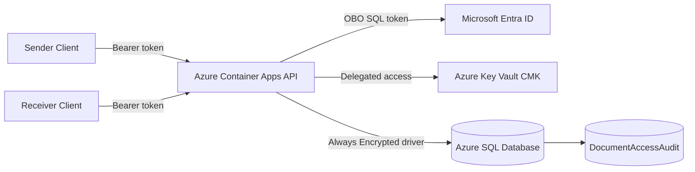

# Arquitetura

## Objetivo

Validar uma PoC em que usuarios autenticados no Microsoft Entra ID gravam e leem documentos sensiveis por meio de uma API em Azure Container Apps, usando OAuth2 On-Behalf-Of para Azure SQL e Azure Key Vault.

## Decisao principal

Esta PoC implementa near-E2EE, nao E2EE estrito.

O SQL Admin nao deve conseguir ler plaintext porque:

- O payload sensivel fica em coluna protegida por Always Encrypted.
- A Column Master Key fica no Azure Key Vault.
- O banco armazena apenas metadata da chave, nao a chave em plaintext.

O backend ainda e trusted compute porque descriptografa dados em memoria quando um usuario autorizado chama a API.

## Diagrama

## Limites conhecidos

- Owner/User Access Administrator no Azure ainda pode alterar RBAC se nao houver segregacao administrativa real.
- ACA pode ver plaintext em memoria durante operacoes autorizadas.
- Endpoints publicos restritos reduzem custo da PoC, mas producao deve usar Private Endpoint, Private DNS e VNet integration.

