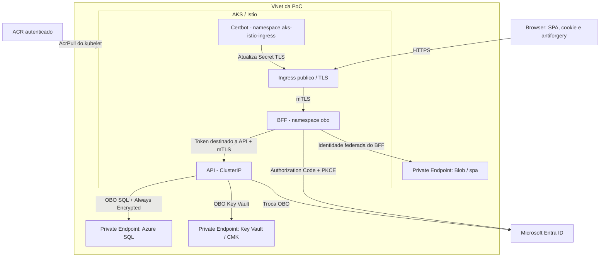
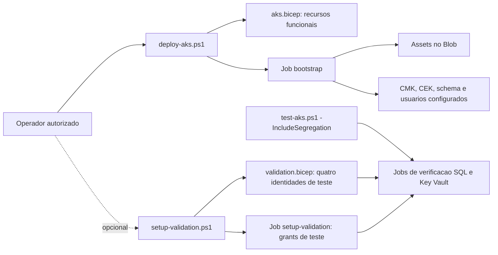

# Arquitetura

SPA e BFF com API OBO no AKS. Istio recebe as chamadas HTTPS e configura mTLS
entre os workloads. O [legado ACA](legacy/aca.md) tem implantação separada.

## Componentes e rede

```mermaid
flowchart TB
    Browser["Browser: SPA, cookie e antiforgery"] -->|HTTPS| Gateway
    Entra["Microsoft Entra ID"]
    subgraph VNet["VNet da PoC"]
        subgraph AKS["AKS / Istio"]
            Gateway["Ingress publico / TLS"]
            BFF["BFF - namespace obo"]
            API["API - ClusterIP"]
            ACME["Certbot - namespace aks-istio-ingress"]
            Gateway -->|mTLS| BFF
            BFF -->|"Token destinado a API + mTLS"| API
            ACME -->|"Atualiza Secret TLS"| Gateway
        end
        Blob["Private Endpoint: Blob / spa"]
        SQL["Private Endpoint: Azure SQL"]
        Vault["Private Endpoint: Key Vault / CMK"]
        BFF -->|"Identidade federada do BFF"| Blob
        API -->|"OBO SQL + Always Encrypted"| SQL
        API -->|"OBO Key Vault"| Vault
    end
    BFF -->|"Authorization Code + PKCE"| Entra
    API -->|"Troca OBO"| Entra
    ACR["ACR autenticado"] -->|AcrPull do kubelet| AKS
```

SQL, Key Vault e Storage usam `publicNetworkAccess=Disabled`, Private Endpoints
e Private DNS. O BFF acessa o Blob pelo SDK com Workload Identity. O template
desabilita acesso anônimo e account keys.

O ingress da aplicação é público. O endpoint administrativo do AKS também é
público, mas exige Entra/RBAC e IP de saída autorizado. A máquina administrativa
é fornecida pelo operador.

O ACR usa endpoint público autenticado. A NetworkPolicy permite HTTPS de saída
sem filtro por FQDN. Application Gateway e WAF não são provisionados.

## Implantação e validação (fora do fluxo de usuários)

```mermaid
flowchart LR
    Operator["Operador autorizado"] --> Deploy["deploy-aks.ps1"]
    Deploy --> Infra["aks.bicep: recursos funcionais"]
    Deploy --> Bootstrap["Job bootstrap"]
    Bootstrap --> Assets["Assets no Blob"]
    Bootstrap --> Schema["CMK, CEK, schema e usuarios configurados"]
    Operator -. opcional .-> Setup["setup-validation.ps1"]
    Setup --> Validation["validation.bicep: quatro identidades de teste"]
    Setup --> Grants["Job setup-validation: grants de teste"]
    Tests["test-aks.ps1 -IncludeSegregation"] --> Jobs["Jobs de verificacao SQL e Key Vault"]
    Validation --> Jobs
    Grants --> Jobs
```

O bootstrap publica os arquivos estáticos e configura banco e usuários.
`setup-validation.ps1` cria os controles opcionais, incluindo dois usuários
`db_owner`. `remove-validation.ps1` os remove sem excluir a aplicação.

## Responsabilidades

| Camada | Responsabilidade | Não faz |
|---|---|---|
| SPA | Exibe sessão, envia arquivo e baixa documento | Login OAuth/token storage no browser |
| Istio | TLS externo, roteamento, mTLS e políticas entre workloads | Login, OBO ou autorização por documento |
| BFF | Cliente OAuth confidencial, sessão/cookie, CSRF e proxy fixo | OBO para SQL/Key Vault |
| API | Valida token, scope e cliente; aplica ACL; executa OBO | Entrega tokens downstream ao navegador |
| Driver SQL | Encripta/desencripta a coluna no processo da API | Entrega a CMK ao SQL |

O BFF entrega a SPA e as rotas `/api/*` pela mesma origem HTTPS.

## Identidades

| Identidade propria | Credencial / autorização |
|---|---|
| App Registration **BFF** e seu service principal | Tipo Web; federação com `system:serviceaccount:obo:bff`; permissão delegada da API; Blob Data Reader no container `spa` |
| App Registration **API** e seu service principal | Federação com `system:serviceaccount:obo:api`; permissões delegadas SQL e Key Vault |
| Managed identities do controle AKS e kubelet | Rede/operação do cluster e AcrPull; não acessam documentos/chaves |
| Managed identity de operações | Publica Blob e cria CMK/CEK; bootstrap SQL usa token temporário do operador |

BFF e API usam Workload Identity Federation, sem client secret. A SPA não possui
App Registration própria. O BFF lê o Blob com seu service principal; SQL e
Key Vault são acessados pela API em nome do usuário.

`SenderObjectIds` e `ReceiverObjectIds` definem os participantes. As quatro
identidades de teste são criadas por `validation.bicep`.
[Matriz de identidades e permissões](identidades-e-permissoes.md).

## Tokens e sessão

| Material | Local | Uso |
|---|---|---|
| Cookie opaco `__Host-obo-session` | Navegador e BFF | Referência a ticket server-side; HttpOnly/Secure/SameSite=Lax |
| Token antiforgery | SPA + cookie antiforgery | Protege POSTs; não e token OAuth |
| Token destinado a API | BFF | Enviado somente no hop BFF -> API |
| Tokens OBO destinados a SQL/Key Vault | API | Audiencias distintas, nunca retornados ao browser |
| Token de workload do pod | Volume projetado no AKS | Autentica a aplicação confidencial perante o Entra |
| Token SQL temporário de bootstrap | Memória do script e Secret Kubernetes efêmero | Prepara o banco; não participa do trafego normal |

`ApiTokenProvider` usa `OpenIdConnect` na aquisição de tokens. `Cookies`
autentica as requisições da sessão.

## Dados, autorização e auditoria

`dbo.Documents.EncryptedPayload` usa Always Encrypted randomized
`AEAD_AES_256_CBC_HMAC_SHA_256`. A CMK RSA fica no Key Vault; o SQL guarda
metadados da CMK e a CEK embrulhada. Metadados do documento e ACL não são cifrados.

A API consulta metadados antes do payload e exige o par `ReceiverTenantId` +
`ReceiverObjectId`. O remetente não ganha direito de leitura automaticamente.
Gravacao e evento `document_create` são transacionais; leitura autorizada atualiza
`ReadAt` e grava `document_read` antes da resposta. Negações e documentos ausentes
também são auditados pela API quando alcancam essa camada.

Não há Row-Level Security. Um usuário com SELECT direto e acesso à chave pode
ler outras linhas; a API é que restringe o destinatário.

## Disponibilidade e limites

O BFF usa uma réplica, Recreate, tickets/cache MSAL em memória e Data Protection
efêmera. Reiniciar o processo invalida sessões. Mais réplicas exigem estado
compartilhado. O cluster tem um node e não oferece HA.

BFF e API processam plaintext nas operações autorizadas. Para E2EE estrito,
a criptografia teria de ocorrer no cliente final.

Veja [fluxos](fluxo-logico.md), [classes](classes-e-metodos.md),
[ameacas](modelo-ameacas.md) e [operação](aks-bff.md).
