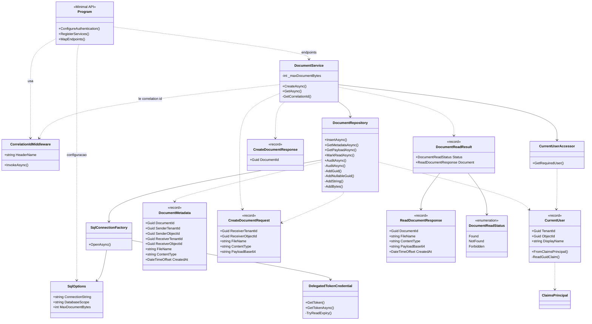

# Classes e Metodos

Este documento descreve as principais classes da API .NET 8, seus metodos e como elas se relacionam no fluxo de escrita e leitura de documentos.

## Diagrama de classes

## Composition root e HTTP

| Classe | Responsabilidade | Metodos / membros |
|--------|------------------|-------------------|
| `Program` | Configura autenticacao JWT Bearer com Microsoft Identity Web, injecao de dependencias, middleware de correlacao e endpoints da Minimal API. | `GET /healthz` retorna status anonimo; `POST /documents` cria documento autenticado; `GET /documents/{documentId}` le documento autenticado e converte o resultado em `200`, `403` ou `404`. |
| `CorrelationIdMiddleware` | Garante um identificador de correlacao por requisicao para resposta HTTP e auditoria. | `HeaderName` define o header `x-correlation-id`; `InvokeAsync` reutiliza um GUID valido do header ou gera um novo, salva em `HttpContext.Items` e ecoa no response header. |

## Servicos e modelos de documento

| Classe | Responsabilidade | Metodos / membros |
|--------|------------------|-------------------|
| `DocumentService` | Orquestra as regras de aplicacao para criar e ler documentos. | `CreateAsync` valida campos, decodifica `PayloadBase64`, aplica limite de tamanho, identifica o usuario atual e delega a gravacao; `GetAsync` busca metadados, valida se o usuario e o receptor autorizado, le payload somente quando permitido e registra auditoria; `GetCorrelationId` recupera o correlation id da requisicao. |
| `CreateDocumentRequest` | DTO de entrada para criacao de documento. | `ReceiverTenantId`, `ReceiverObjectId`, `FileName`, `ContentType`, `PayloadBase64`. |
| `CreateDocumentResponse` | DTO de saida da criacao. | `DocumentId`. |
| `ReadDocumentResponse` | DTO retornado na leitura autorizada. | `DocumentId`, `FileName`, `ContentType`, `PayloadBase64`, `CreatedAt`. |
| `DocumentReadResult` | Resultado interno da leitura, separando status HTTP de payload. | `Status` indica `Found`, `NotFound` ou `Forbidden`; `Document` contem o DTO quando encontrado e autorizado. |
| `DocumentReadStatus` | Enum que representa o resultado funcional da leitura. | `Found`, `NotFound`, `Forbidden`. |

## Acesso a dados

| Classe | Responsabilidade | Metodos / membros |
|--------|------------------|-------------------|
| `DocumentRepository` | Encapsula comandos SQL para documentos e auditoria. | `InsertAsync` grava documento e evento `document_create` em transacao; `GetMetadataAsync` busca metadados sem retornar o payload criptografado; `GetPayloadAsync` le o payload com Always Encrypted habilitado; `MarkReadAsync` atualiza `ReadAt` e registra `document_read`; `AuditAsync` registra eventos de acesso; helpers privados `AddGuid`, `AddNullableGuid`, `AddString` e `AddBytes` tipam parametros SQL. |
| `DocumentMetadata` | Record com metadados usados para autorizacao e resposta. | `DocumentId`, dados de sender/receiver, `FileName`, `ContentType`, `CreatedAt`. |
| `SqlConnectionFactory` | Cria conexoes SQL autenticadas com token OBO e registra o provider de Always Encrypted para Azure Key Vault. | `OpenAsync` cria `SqlConnection`, registra `SqlColumnEncryptionAzureKeyVaultProvider`, obtem token delegado para `DatabaseScope`, atribui `AccessToken` e abre a conexao. |

## Seguranca

| Classe | Responsabilidade | Metodos / membros |
|--------|------------------|-------------------|
| `CurrentUser` | Representa o usuario autenticado a partir de claims do Microsoft Entra ID. | `FromClaimsPrincipal` extrai `tid`, `oid` e nome exibivel; `ReadGuidClaim` valida claims GUID obrigatorias e falha com `UnauthorizedAccessException` quando ausentes ou invalidas. |
| `CurrentUserAccessor` | Recupera o usuario atual do `HttpContext`. | `GetRequiredUser` exige identidade autenticada e retorna `CurrentUser`. |
| `DelegatedTokenCredential` | Adapta `ITokenAcquisition` para `TokenCredential`, permitindo que o provider do Azure Key Vault use token delegado do usuario. | `GetToken` chama a versao assincrona de forma sincrona; `GetTokenAsync` exige usuario autenticado, solicita token para os scopes pedidos e retorna `AccessToken`; `TryReadExpiry` extrai expiracao do JWT. |

## Configuracao

| Classe | Responsabilidade | Metodos / membros |
|--------|------------------|-------------------|
| `SqlOptions` | Representa a secao `Sql` da configuracao. | `ConnectionString` aponta para o Azure SQL com `Column Encryption Setting=Enabled`; `DatabaseScope` define o scope OBO para Azure SQL; `MaxDocumentBytes` limita o tamanho do documento antes da gravacao. |
