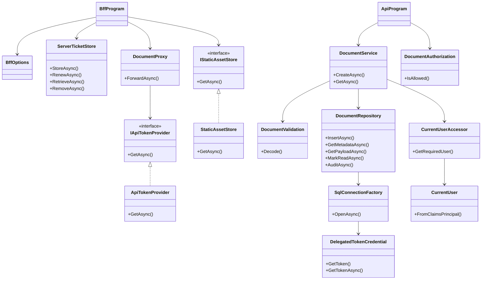

# Classes e métodos

Tipos da API, do BFF e das operações .NET 8.
`BffProgram` e `ApiProgram` no diagrama representam os respectivos `Program.cs`.

## Relacoes principais

```mermaid
classDiagram
    class BffProgram
    class ApiProgram
    class BffOptions
    class ServerTicketStore {
        +StoreAsync()
        +RenewAsync()
        +RetrieveAsync()
        +RemoveAsync()
    }
    class DocumentProxy {
        +ForwardAsync()
    }
    class IApiTokenProvider {
        <<interface>>
        +GetAsync()
    }
    class ApiTokenProvider {
        +GetAsync()
    }
    class IStaticAssetStore {
        <<interface>>
        +GetAsync()
    }
    class StaticAssetStore {
        +GetAsync()
    }
    class DocumentService {
        +CreateAsync()
        +GetAsync()
    }
    class DocumentValidation {
        +Decode()
    }
    class DocumentAuthorization {
        +IsAllowed()
    }
    class DocumentRepository {
        +InsertAsync()
        +GetMetadataAsync()
        +GetPayloadAsync()
        +MarkReadAsync()
        +AuditAsync()
    }
    class SqlConnectionFactory {
        +OpenAsync()
    }
    class DelegatedTokenCredential {
        +GetToken()
        +GetTokenAsync()
    }
    class CurrentUserAccessor {
        +GetRequiredUser()
    }
    class CurrentUser {
        +FromClaimsPrincipal()
    }
    BffProgram --> BffOptions
    BffProgram --> ServerTicketStore
    BffProgram --> DocumentProxy
    BffProgram --> IStaticAssetStore
    IStaticAssetStore <|.. StaticAssetStore
    IApiTokenProvider <|.. ApiTokenProvider
    DocumentProxy --> IApiTokenProvider
    ApiProgram --> DocumentAuthorization
    ApiProgram --> DocumentService
    DocumentService --> CurrentUserAccessor
    CurrentUserAccessor --> CurrentUser
    DocumentService --> DocumentValidation
    DocumentService --> DocumentRepository
    DocumentRepository --> SqlConnectionFactory
    SqlConnectionFactory --> DelegatedTokenCredential
```

## BFF (`src\bff`)

| Tipo / arquivo | Responsabilidade e membros |
|---|---|
| `Program.cs` | Configura Cookies + OIDC/PKCE, MSAL, ticket store, antiforgery, Blob client, HttpClient fixo, headers de seguranca, proxy e rotas |
| `BffOptions` | `PublicOrigin`, `ApiBaseUrl`, `ApiScope`, `BlobContainerUrl`; `IsHttpsOrigin` valida a origem externa |
| `ServerTicketStore : ITicketStore` | Gera chave aleatoria; serializa tickets em IMemoryCache; Store/Renew/Retrieve/Remove; TTL acompanha expiração do ticket |
| `IApiTokenProvider` / `ApiTokenProvider` | `GetAsync(ClaimsPrincipal)` pede o token para o scope da API com esquema **OpenIdConnect**, não Cookies |
| `DocumentProxy` | `ForwardAsync` exige CSRF/JSON em POST, acrescenta token server-side e correlation ID, encaminha somente rotas permitidas, filtra headers e trata falhas de transporte |
| `IStaticAssetStore` / `StaticAssetStore` | `GetAsync` baixa asset pelo Blob SDK; distingue 404 de falhas reais; usa MIME fixo da allowlist |
| `StaticAsset` | Record com stream e content type para resposta do asset |

O HttpClient não segue redirects nem usa cookies do upstream. As rotas dos três
arquivos estáticos são fixas.
`DocumentProxy` vincula o cancelamento do cliente a um prazo de 90 segundos para
envio e cópia da resposta. Timeout retorna 504 antes dos headers de resposta ou
aborta a conexão se a resposta já começou.

## API (`src\api`)

| Tipo / arquivo | Responsabilidade e membros |
|---|---|
| `Program.cs` | Autenticação JWT, aquisição OBO, política `documents`, DI, ProblemDetails e endpoints internos |
| `DocumentAuthorization` | `IsAllowed` exige autenticação, scope `user_impersonation` e, quando configurado, `AllowedClientId` correspondente a `azp`/`appid` |
| `CurrentUser` | Record `TenantId`, `ObjectId`, `DisplayName`; `FromClaimsPrincipal`/`ReadGuidClaim` validam claims GUID |
| `CurrentUserAccessor` | `GetRequiredUser` exige principal autenticado do HttpContext |
| `DelegatedTokenCredential : TokenCredential` | `GetToken`/`GetTokenAsync` adaptam ITokenAcquisition para o provider Key Vault; `TryReadExpiry` le expiração do JWT |
| `DocumentValidation` | `Decode` valida destinatário/metadados/Base64, tamanho codificado e bytes decodificados; erros 400/413 |
| `DocumentService` | `CreateAsync` identifica sender e persiste; `GetAsync` consulta metadados, aplica ACL antes do payload e audita; `GetCorrelationId` recupera o ID da requisição |
| `DocumentRepository` | `InsertAsync` + audit em transação; `GetMetadataAsync` sem payload; `GetPayloadAsync`; `MarkReadAsync` atualiza ReadAt + audit; overloads de `AuditAsync`; parâmetros SQL tipados |
| `SqlConnectionFactory` | `OpenAsync` obtem token SQL delegado, registra provider AKV na conexão e abre SqlConnection com Always Encrypted |
| `CorrelationIdMiddleware` | `InvokeAsync` aceita GUID válido de `x-correlation-id` ou gera outro, salva em Items e ecoa no header |
| `SqlOptions` | Connection string, DatabaseScope e MaxDocumentBytes |

## Modelos de documentos

| Record / enum | Campos |
|---|---|
| `CreateDocumentRequest` | ReceiverTenantId, ReceiverObjectId, FileName, ContentType, PayloadBase64 |
| `CreateDocumentResponse` | DocumentId |
| `ReadDocumentResponse` | DocumentId, FileName, ContentType, PayloadBase64, CreatedAt |
| `DocumentMetadata` | DocumentId, sender/receiver tid+oid, FileName, ContentType, CreatedAt |
| `DocumentReadResult` | Status e Document opcional |
| `DocumentReadStatus` | Found, NotFound, Forbidden |

`PayloadBase64` contém os bytes codificados para transporte. O driver cifra
a coluna antes de enviar o comando SQL.

## SPA (`src\spa`)

`index.html` define formularios com GUIDs canonicos. `app.js` usa:

- `refreshSession`: consulta estado, atualiza a tela e guarda antiforgery em memória.
- `api`: fetch same-origin, no-store, cookies de sessão, CSRF e mensagens por status.
- `run`: bloqueia o botao durante a operação e exibe falhas.
- Handlers de envio/leitura/logout: Base64, comparação de limites, download como
  `application/octet-stream`, nome seguro e revogação da URL Blob temporaria.

Não existe MSAL no browser, localStorage/sessionStorage para tokens ou captura
de senha. Conteúdo retornado não e inserido via `innerHTML`.

## Operações (`src\operations`)

`Program.cs` e um executavel de Job, não um endpoint HTTP. O modo funcional
`bootstrap` publica assets e prepara schema/usuários reais, sem variáveis TEST.
Os modos opcionais são `setup-validation`, `remove-validation`, `sender`,
`reader`, `admin-with-key` e `admin-without-key`.
Helpers locais: `Scalar`, `Execute`, `Insert`, `Payload`, `VerifyPlaintext`,
`MustDenySql` e `IsKeyVaultForbidden`.

O bootstrap consome o template SQL compartilhado e mantem client ID (SID SQL)
das identidades de teste separado de object ID (usuários humanos/RBAC/ACL).
`ApplicationUser.Parse` valida o JSON dos participantes e une as permissões do
mesmo usuário. Os testes comparam o documento pelo ID e pelos bytes. As negações
esperadas são SQL 229 e Key Vault 403/ForbiddenByRbac.
O token SQL adquirido e mantido na variavel local para as conexões AE/raw; não e
lido novamente do getter `AccessToken` após abrir a conexão.

## Automacao e testes

`azure-common.ps1` centraliza chamadas Azure CLI com verificação de exit code,
subscription explícita e conferência do contexto antes de operações de diretório.
Os scripts legados também usam esse helper e validam o tenant quando informado.
`aks-common.ps1` o carrega e acrescenta kubectl, renderização e Jobs.
`deploy-aks.ps1` provisiona recursos, constroi imagens e aplica workloads;
`test-aks.ps1` verifica o ambiente e, com `-IncludeSegregation`, executa os
testes diretos SQL/Key Vault. `setup-validation.ps1` e `remove-validation.ps1`
administram somente recursos/grants opcionais.
Os scripts usam Azure CLI e kubectl. [Procedimento de deploy](deploy.md).

`New-DeploymentState` preserva tags construidas em atualizacoes de infraestrutura;
`Assert-PublishedImages` impede publicar tags inexistentes. `certificate.py`
executa Certbot e sincroniza o Secret tanto em renovação como em reutilizacao.
`Render-Manifest` grava a revisão SHA-256 no pod template para aplicar mudanças
de configuração sem exigir nova tag de imagem.

Os testes estão em `src\api.Tests`, `src\bff.Tests`, `src\operations.Tests`,
`tests\scripts`, `tests\python` e `tests\browser`.
[Execução e cobertura](validacao.md).
