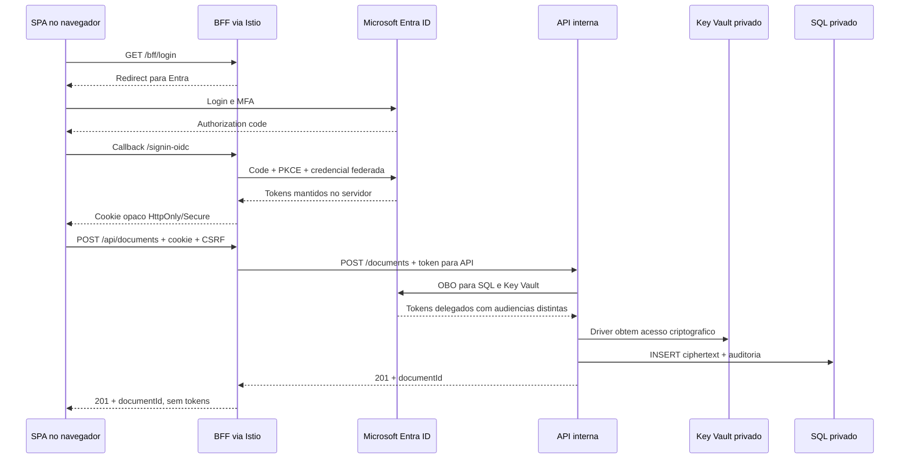

# Fluxo de chamadas

As rotas `/api/*` pertencem ao BFF. `/documents` pertence à API interna.
[Diagrama de arquitetura](arquitetura.md).

## Carregamento e login

1. O navegador acessa o ingress HTTPS do Istio.
2. O BFF le `index.html`, `app.js` e `styles.css` do Blob privado usando sua
   identidade federada. Os assets voltam pela origem publica do BFF.
3. A SPA consulta `GET /bff/session`; sem sessão recebe `authenticated=false`.
4. `GET /bff/login` inicia Authorization Code + PKCE com Microsoft Entra ID.
5. O usuário conclui login/MFA no Entra. O callback `/signin-oidc` chega ao BFF.
6. O BFF resgata o authorization code, mantem tokens no cache MSAL e cria ticket
   server-side. O navegador recebe apenas o cookie opaco de sessão.
7. `/bff/session` retorna nome, `tenantId`, `objectId` e `csrfToken`.
   O token CSRF é usado na validação dos POSTs.



## Escrita

O BFF exige sessão, antiforgery válido e JSON. Cria o correlation ID e acrescenta
o token destinado à API, sem copiar Authorization ou cookies do navegador.

A API valida JWT, scope `user_impersonation` e, no deploy AKS, `azp`/`appid` do BFF.
Extrai `tid`/`oid`, valida o destinatário e os metadados, decodifica Base64 e aplica
limite de **10 MiB** por documento. O corpo HTTP, incluindo Base64 e JSON,
tem limite de 15 MiB.

`SqlConnectionFactory` abre a conexão com token SQL OBO e provider Key Vault
por conexão. `DelegatedTokenCredential` entrega ao driver o token delegado para
Key Vault. O driver cifra o payload antes de envia-lo ao SQL. Documento e auditoria
`document_create/allowed` são gravados na mesma transação.

## Exemplo de contrato HTTP

Chamada do navegador ao BFF após o login. Substitua os placeholders.
O navegador envia cookie e antiforgery:

```http
POST /api/documents HTTP/1.1
Content-Type: application/json
Cookie: __Host-obo-session=<cookie-opaco>
x-csrf-token: <antiforgery-da-sessao>

{
  "receiverTenantId": "<tenant-id-do-destinatario>",
  "receiverObjectId": "<object-id-do-destinatario>",
  "fileName": "exemplo.txt",
  "contentType": "text/plain",
  "payloadBase64": "SGVsbG8="
}
```

`SGVsbG8=` codifica o texto UTF-8 `Hello`. O BFF acrescenta o bearer na chamada
interna `POST /documents`. A resposta ao navegador tem status 201 e corpo:

```json
{ "documentId": "<document-id-gerado>" }
```

Na leitura, o navegador chama `GET /api/documents/<document-id>` com o cookie.
O BFF chama a API interna com seu token delegado. Se autorizado, o corpo retorna
`documentId`, `fileName`, `contentType`, `payloadBase64` e `createdAt`.

## Leitura

1. SPA envia `GET /api/documents/{id}` com cookie.
2. BFF obtem token para API e encaminha `GET /documents/{id}`.
3. API consulta **somente metadados**. Se ausente, audita `not_found` e retorna 404.
4. API compara destinatário com `tid` + `oid` do usuário. Se diferente, audita
   `denied`, retorna 403 e não consulta/descriptografa o payload.
5. Se autorizado, consulta `EncryptedPayload`; driver SQL usa Always Encrypted
   e o acesso delegado a CMK para devolver plaintext no processo da API.
6. API atualiza `ReadAt` e grava `document_read/allowed` em transação.
7. Retorna metadados e Base64 pelo BFF. A SPA baixa um Blob de bytes, sem renderizar
   o documento como HTML e sem receber os tokens de SQL/Key Vault.

## Erros e logout

| Situação | Resultado |
|---|---|
| Sem sessão no BFF | 401 nas rotas de documentos |
| POST sem CSRF válido | 400 antes de chamar a API |
| Corpo não JSON no proxy | 415 |
| Metadados/Base64 inválidos | 400 |
| Documento acima do limite | 413 |
| Destinatário diferente | 403 |
| Documento inexistente | 404 |
| Falha de conexão/timeout do proxy antes de iniciar a resposta | 502/504 |
| Falha de transporte/timeout após iniciar a resposta | Conexão abortada, sem entregar o corpo completo |
| Token não pode ser renovado silenciosamente | 401 para novo login |

O BFF não repassa cookies, redirects ou challenges arbitrarios do upstream.
As respostas usam `Cache-Control: no-store`. Negações anteriores a API, como CSRF
ou sessão ausente, não geram automaticamente linhas em `DocumentAccessAudit`.
O limite de 90 segundos do proxy cobre o envio à API e a transferência completa
da resposta ao navegador, não apenas a chegada dos headers.

`POST /bff/logout` exige CSRF e remove o ticket de sessão. Isso encerra a sessão
local, não o SSO global do Entra. Reiniciar o BFF também invalida sessões porque
ticket store, MSAL e Data Protection são locais ao processo.

## Fluxos operacionais

O bootstrap configura chaves, schema e participantes em um Job no cluster.
`setup-validation.ps1` cria os controles opcionais e
`test-aks.ps1 -IncludeSegregation` executa seus Jobs. Eles acessam SQL/Key Vault
diretamente, sem OBO.
Consulte
[operação](aks-bff.md) e [separacao de tarefas](separation-of-duties.md).
